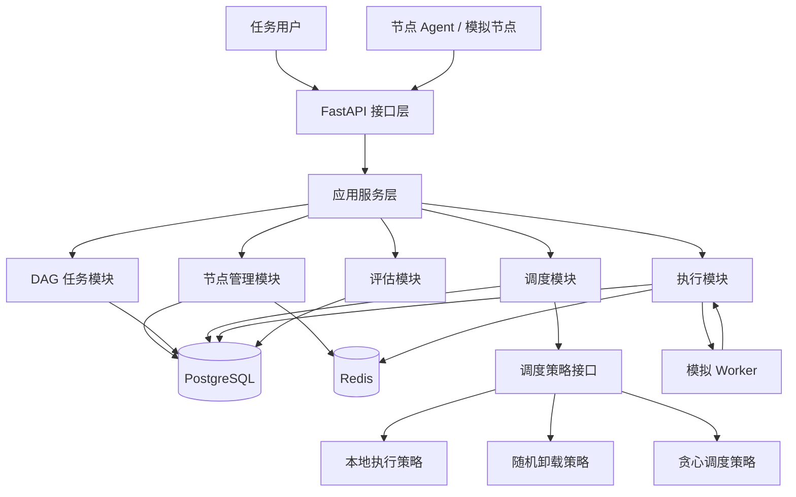
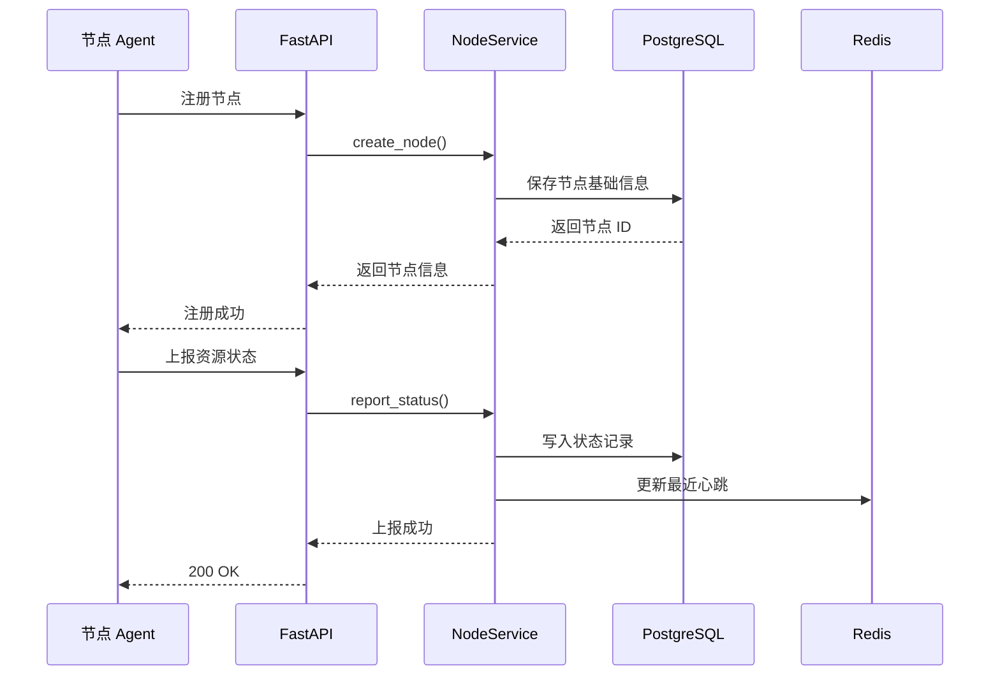
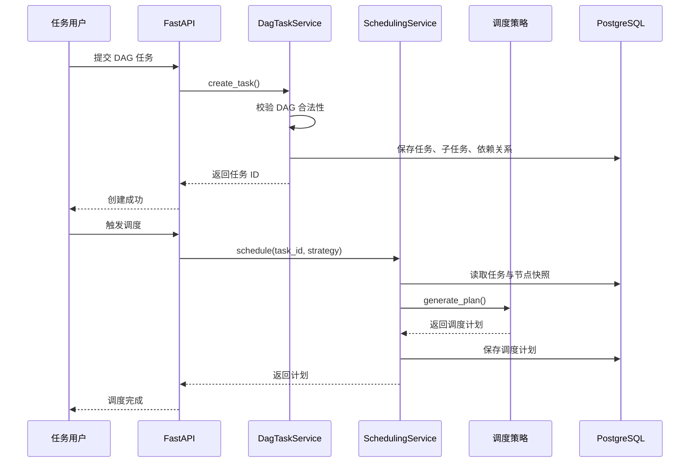
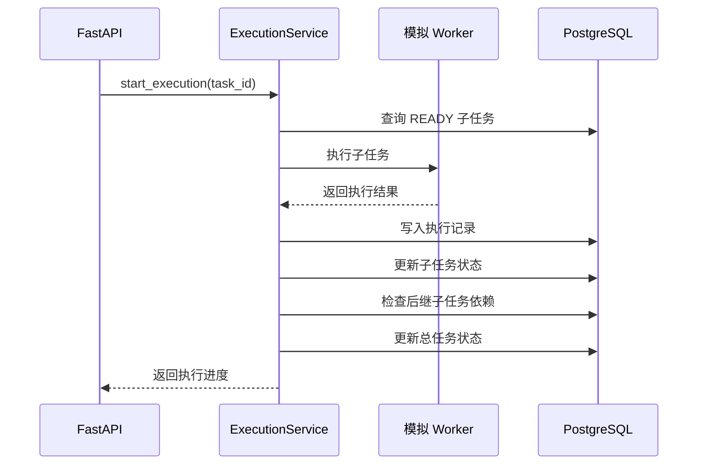

# 系统架构设计文档

## 1. 文档目的

本文档用于描述“面向无人机边缘计算的 DAG 任务卸载调度系统”的总体架构设计，明确系统模块边界、核心数据流、运行形态、调度器设计、状态一致性策略和后续演进方向。

本文档承接 `docs/03_requirements_analysis.md`，后续数据库设计、API 设计、状态机设计和测试设计都应以本文档为基础。

## 2. 设计目标

第一阶段的目标不是一次性实现工业级分布式系统，而是先完成一个真实、可运行、可测试的后端闭环：

1. 支持无人机节点和边缘节点注册。
2. 支持节点周期性上报资源状态。
3. 支持用户提交 DAG 任务。
4. 支持系统校验 DAG 合法性。
5. 支持调度器根据节点状态生成调度计划。
6. 支持模拟 Worker 执行子任务并回传结果。
7. 支持任务状态、执行结果和基础指标查询。

为了降低初期复杂度，第一阶段采用“模块化单体”架构：代码按领域模块拆分，但运行时先部署为一个 FastAPI 后端服务。RabbitMQ、Celery、MQTT、Prometheus、Grafana 和 OpenTelemetry 放在后续阶段逐步引入。

## 3. 总体架构

### 3.1 架构风格

系统第一阶段采用模块化单体架构：

- 对外暴露 REST API。
- 内部按节点管理、DAG 任务、调度、执行、评估等模块组织。
- PostgreSQL 作为主数据存储。
- Redis 用于缓存节点心跳、短期状态和后续分布式锁预留。
- 模拟 Worker 先作为后端内部模块运行，后续可拆成 Celery Worker 或独立 Agent。

### 3.2 总体架构图



## 4. 模块划分

### 4.1 接口层

接口层负责接收 HTTP 请求、参数校验、认证预留、响应封装和错误码转换。

第一阶段主要提供：

- 节点注册接口。
- 节点状态上报接口。
- DAG 任务创建接口。
- 调度计划生成接口。
- 模拟执行触发接口。
- 任务状态和结果查询接口。

接口层不直接写复杂业务逻辑，只调用应用服务层。

### 4.2 应用服务层

应用服务层负责组织业务用例，协调多个领域模块完成完整流程。

典型服务包括：

- `NodeService`：节点注册、状态上报、离线检测。
- `DagTaskService`：任务创建、DAG 校验、任务状态流转。
- `SchedulingService`：读取任务和节点状态，调用调度策略生成计划。
- `ExecutionService`：派发子任务、接收执行结果、处理重试。
- `MetricsService`：统计耗时、成功率、失败率、重试次数等指标。

### 4.3 节点管理模块

节点管理模块负责维护无人机和边缘节点的基础信息、资源状态和在线状态。

核心职责：

1. 注册无人机节点和边缘节点。
2. 接收节点心跳和资源上报。
3. 记录 CPU、内存、电量、网络质量、位置和负载。
4. 根据最后心跳时间判断节点是否离线。
5. 为调度模块提供可用节点快照。

设计原则：

- PostgreSQL 保存节点基础信息和状态历史。
- Redis 可保存最近一次心跳和短期状态，便于快速判断在线情况。
- 调度器使用的是“调度时刻的节点快照”，避免调度过程中状态变化导致结果不可追踪。

### 4.4 DAG 任务模块

DAG 任务模块负责任务定义、子任务定义、依赖关系和状态流转。

核心职责：

1. 接收用户提交的 DAG 任务。
2. 校验子任务 ID 是否重复。
3. 校验依赖的子任务是否存在。
4. 检测是否存在环形依赖。
5. 识别入口子任务和出口子任务。
6. 维护总任务和子任务状态。

第一阶段的 DAG 校验应作为纯业务逻辑实现，方便单元测试。

### 4.5 调度模块

调度模块负责把 DAG 任务映射到可执行节点上。

核心职责：

1. 读取 DAG 子任务和依赖关系。
2. 读取无人机与边缘节点状态快照。
3. 根据策略生成调度计划。
4. 估算开始时间、结束时间、传输耗时和能耗。
5. 保存调度计划，供执行模块使用。

调度模块不直接执行任务，只负责生成计划。

### 4.6 执行模块

执行模块负责根据调度计划模拟子任务执行，并处理结果回传。

第一阶段可以采用后端内置模拟 Worker：

1. 找到所有依赖已满足的 `READY` 子任务。
2. 将子任务状态改为 `DISPATCHED` 或 `RUNNING`。
3. 按子任务计算量和节点能力模拟耗时。
4. 写入执行记录。
5. 回传成功或失败结果。
6. 推动后继子任务进入 `READY` 状态。

后续阶段可替换为 Celery Worker、RabbitMQ 消息队列或真实节点 Agent。

### 4.7 评估模块

评估模块负责从任务执行记录中计算系统指标。

第一阶段指标包括：

- 总任务完成耗时。
- 子任务平均耗时。
- 成功率。
- 失败率。
- 重试次数。
- 本地执行比例。
- 卸载执行比例。

后续可扩展：

- 节点资源利用率。
- 网络传输耗时占比。
- 能耗估算。
- 不同调度策略对比结果。

### 4.8 平台管理模块

平台管理模块负责工程支撑能力。

第一阶段包括：

- 统一配置。
- 统一日志。
- 健康检查接口。
- OpenAPI 文档。

后续阶段加入：

- Prometheus 指标。
- Grafana 看板。
- OpenTelemetry 链路追踪。

## 5. 核心数据流

### 5.1 节点注册与状态上报



### 5.2 DAG 提交与调度



### 5.3 子任务执行与结果回传



## 6. 调度器设计

### 6.1 调度器输入

调度器输入应包含：

- DAG 任务信息。
- 子任务计算量、输入数据大小、输出数据大小。
- 子任务依赖关系。
- 当前可用无人机节点状态。
- 当前可用边缘节点状态。
- 调度策略名称和策略参数。

### 6.2 调度器输出

调度器输出调度计划，至少包括：

- 子任务 ID。
- 分配执行节点 ID。
- 执行节点类型。
- 预计开始时间。
- 预计结束时间。
- 预计计算耗时。
- 预计传输耗时。
- 预计能耗。
- 策略名称。

### 6.3 调度策略接口

调度策略应设计为可插拔接口。不同策略实现相同输入输出，便于测试和对比。

```text
SchedulerStrategy
  - name
  - generate_plan(task_graph, node_snapshot, options) -> schedule_plan
```

### 6.4 第一阶段策略

第一阶段实现三种策略：

1. 本地执行策略  
   所有子任务都分配给无人机本地执行，用作基线。

2. 随机卸载策略  
   在可用节点中随机选择执行节点，用作简单对比基线。测试时应支持固定随机种子。

3. 贪心调度策略  
   对每个可调度子任务估算本地执行和边缘执行成本，优先选择预计完成时间更短、资源更充足的节点。

### 6.5 贪心策略初版成本模型

第一阶段可以使用简化成本模型：

```text
total_cost = compute_time + transfer_time + energy_cost_weight * energy_cost
```

其中：

- `compute_time = task_compute_load / node_compute_capacity`
- `transfer_time = input_data_size / network_bandwidth`
- `energy_cost` 对无人机本地执行和无线传输分别估算
- `energy_cost_weight` 用于调整能耗在成本中的权重

该模型不追求绝对真实，但要保证可解释、可测试、可逐步替换。

## 7. 状态一致性设计

### 7.1 状态更新原则

任务状态和子任务状态必须由服务层统一更新，避免接口层或 Worker 直接散落修改状态。

状态更新应遵循：

1. 只允许合法状态迁移。
2. 每次状态变化记录时间。
3. 失败原因必须可查询。
4. 重复结果回传必须幂等。
5. 总任务状态由子任务状态聚合得到。

### 7.2 幂等设计

执行结果回传需要支持幂等处理：

- 每次执行生成唯一 `execution_id`。
- 同一个 `execution_id` 的重复回传只处理一次。
- 已经处于 `SUCCESS` 的子任务不应被失败结果覆盖。
- 已经终止的总任务不应继续接受普通执行结果。

### 7.3 事务边界

以下操作应在数据库事务中完成：

- 创建 DAG 任务、子任务和依赖关系。
- 保存调度计划并更新任务状态。
- 写入执行记录并更新子任务状态。
- 更新子任务状态后聚合总任务状态。

## 8. 数据存储边界

详细表结构放到后续数据库设计文档中。本文档只定义主要实体边界：

- `nodes`：节点基础信息。
- `node_status_records`：节点状态上报历史。
- `dag_tasks`：总任务。
- `dag_subtasks`：子任务。
- `dag_dependencies`：子任务依赖关系。
- `schedule_plans`：调度计划。
- `schedule_plan_items`：每个子任务的调度结果。
- `execution_records`：子任务执行记录。
- `task_metrics`：任务统计指标。

PostgreSQL 是最终事实来源。Redis 只保存可重建的临时状态，不作为核心业务数据的唯一存储。

## 9. API 边界

详细接口字段放到后续 API 设计文档中。本文档先定义接口分组：

- `/api/v1/nodes`：节点注册、查询。
- `/api/v1/nodes/{node_id}/status`：节点状态上报。
- `/api/v1/tasks`：DAG 任务创建、查询。
- `/api/v1/tasks/{task_id}/schedule`：触发调度。
- `/api/v1/tasks/{task_id}/execute`：触发模拟执行。
- `/api/v1/tasks/{task_id}/results`：查询执行结果。
- `/api/v1/tasks/{task_id}/metrics`：查询任务指标。
- `/api/v1/health`：健康检查。

## 10. 部署设计

### 10.1 第一阶段开发环境

第一阶段最小开发环境包括：

- `api`：FastAPI 后端服务。
- `postgres`：PostgreSQL 数据库。
- `redis`：Redis 缓存。

模拟 Worker 可以先内置在 `api` 服务中，后续再拆出独立进程。

### 10.2 后续部署演进

第二阶段加入：

- `rabbitmq`：任务消息队列。
- `celery-worker`：异步执行 Worker。
- `mqtt-broker`：模拟真实设备通信。

第三阶段加入：

- `prometheus`：指标采集。
- `grafana`：监控看板。
- `otel-collector`：链路追踪采集。

## 11. 可测试性设计

第一阶段必须优先覆盖以下测试：

1. DAG 合法性校验测试。
2. 任务状态迁移测试。
3. 节点状态上报测试。
4. 调度策略单元测试。
5. 模拟执行闭环测试。
6. 重复结果回传幂等测试。

测试层次建议：

- 纯函数逻辑用单元测试。
- 服务层用数据库集成测试。
- API 层用 FastAPI TestClient。
- 完整闭环用端到端集成测试。

## 12. 异常处理设计

系统应明确处理以下异常：

| 异常 | 处理方式 |
| --- | --- |
| DAG 不合法 | 拒绝创建任务，返回具体原因 |
| 无可用节点 | 任务保持 `PENDING` 或 `SCHEDULED` 失败原因 |
| 节点离线 | 标记节点 `OFFLINE`，受影响子任务进入失败或等待重调度 |
| 子任务执行失败 | 记录失败原因，根据重试策略决定是否重试 |
| 重复回传结果 | 按 `execution_id` 幂等处理 |
| 调度策略不存在 | 返回参数错误 |

## 13. 日志与观测设计

第一阶段先保证关键日志完整：

- 节点注册日志。
- 节点状态上报日志。
- DAG 创建和校验失败日志。
- 调度计划生成日志。
- 子任务执行开始、成功、失败日志。
- 总任务状态变化日志。

日志中应包含 `task_id`、`subtask_id`、`node_id`、`strategy` 等关键字段，便于后续接入结构化日志和链路追踪。

## 14. 第一阶段闭环验收映射

| 需求验收项 | 架构支持 |
| --- | --- |
| 注册无人机和边缘节点 | 节点管理模块 |
| 上报节点资源状态 | 节点管理模块、Redis、PostgreSQL |
| 提交 5 个子任务 DAG | DAG 任务模块 |
| 校验 DAG 合法 | DAG 校验逻辑 |
| 使用贪心策略生成计划 | 调度模块、贪心策略 |
| 模拟 Worker 执行 | 执行模块、模拟 Worker |
| 查询最终状态 `SUCCESS` | DAG 任务模块、执行模块 |
| 查询执行节点、耗时和结果 | 执行记录、评估模块 |

## 15. 后续文档计划

建议继续按以下顺序推进：

1. `docs/05_database_design.md`：数据库表设计和 ER 图。
2. `docs/06_api_design.md`：核心 API 请求和响应草案。
3. `docs/07_state_machine_design.md`：任务、子任务、节点状态机。
4. `docs/08_backend_scaffold_plan.md`：FastAPI 项目结构和实现计划。

## 16. 当前结论

本系统第一阶段应采用模块化单体架构，以 FastAPI、PostgreSQL、SQLAlchemy、Alembic、Redis 和 pytest 打通主闭环。调度策略先做成可插拔接口，执行模块先用模拟 Worker，保证系统能真实跑通任务提交、调度、执行、回传和查询流程。

当主闭环稳定后，再逐步引入消息队列、异步 Worker、MQTT、监控和链路追踪，把系统从学习型后端项目演进为更接近真实无人机边缘计算平台的工程系统。
