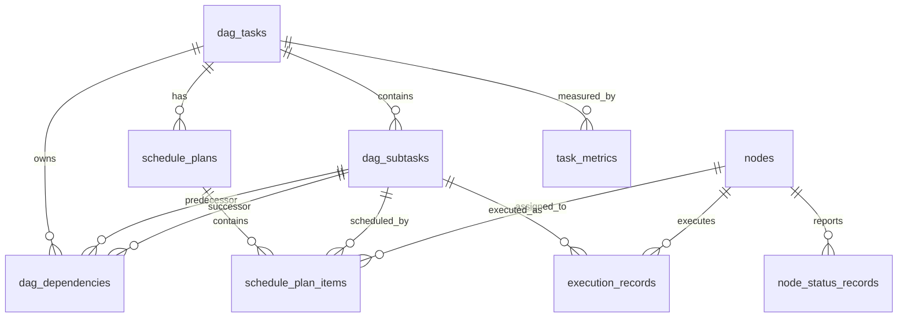

# 数据库设计文档

## 1. 文档目的

本文档用于定义“面向无人机边缘计算的 DAG 任务卸载调度系统”第一阶段的数据库结构，包括核心实体、表关系、字段设计、枚举值、约束、索引和事务边界。

后续 SQLAlchemy 2.0 模型、Alembic 迁移脚本、API 字段设计和测试数据构造都应以本文档为依据。

## 2. 设计原则

### 2.1 PostgreSQL 作为事实来源

PostgreSQL 保存所有核心业务数据，包括节点、任务、子任务、依赖关系、调度计划、执行记录和指标结果。Redis 只保存可重建的临时状态，例如最近心跳、短期锁和后续异步队列辅助信息。

### 2.2 业务主键使用 UUID

第一阶段建议所有核心业务表使用 UUID 作为主键：

- API 暴露时不泄漏自增序列。
- 后续拆分 Worker 或 Agent 时更容易生成唯一标识。
- 测试数据可以明确指定 ID，便于构造 DAG 依赖。

### 2.3 状态字段使用枚举约束

任务状态、子任务状态、节点类型、节点状态、执行状态等字段应有明确枚举值。实现时可以用 PostgreSQL Enum，也可以先用字符串加 CHECK 约束。第一阶段为了迁移简单，推荐先使用字符串枚举。

### 2.4 历史记录不覆盖

节点状态上报、执行记录和调度计划都应保留历史记录。当前状态可以保存在主表中，历史变化保存在记录表中，便于后续做指标分析和策略对比。

### 2.5 时间字段统一使用 `timestamptz`

所有时间字段统一使用带时区时间类型，避免后续部署环境变化导致时间含义混乱。

## 3. 核心实体关系



## 4. 枚举定义

### 4.1 节点类型

| 值 | 含义 |
| --- | --- |
| `UAV` | 无人机节点 |
| `EDGE` | 边缘计算节点 |

### 4.2 节点状态

| 值 | 含义 |
| --- | --- |
| `ONLINE` | 在线且可接收任务 |
| `BUSY` | 在线但负载较高 |
| `OFFLINE` | 离线或心跳超时 |

### 4.3 DAG 总任务状态

| 值 | 含义 |
| --- | --- |
| `PENDING` | 已创建，等待调度 |
| `SCHEDULED` | 已生成调度计划 |
| `RUNNING` | 已开始执行 |
| `SUCCESS` | 所有子任务成功 |
| `FAILED` | 任务失败且无法继续 |
| `CANCELED` | 用户或系统取消 |

### 4.4 子任务状态

| 值 | 含义 |
| --- | --- |
| `WAITING` | 等待前置依赖完成 |
| `READY` | 依赖已满足，可执行 |
| `DISPATCHED` | 已下发到执行节点 |
| `RUNNING` | 正在执行 |
| `SUCCESS` | 执行成功 |
| `FAILED` | 执行失败 |
| `RETRYING` | 等待重试 |

### 4.5 调度计划状态

| 值 | 含义 |
| --- | --- |
| `GENERATED` | 已生成但未执行 |
| `APPLIED` | 已被执行模块采用 |
| `CANCELED` | 已取消 |

### 4.6 执行状态

| 值 | 含义 |
| --- | --- |
| `RUNNING` | 执行中 |
| `SUCCESS` | 执行成功 |
| `FAILED` | 执行失败 |
| `TIMEOUT` | 执行超时 |
| `CANCELED` | 执行取消 |

## 5. 表设计

### 5.1 `nodes`

节点基础信息表，保存无人机和边缘节点的静态信息与当前状态。

| 字段 | 类型 | 约束 | 说明 |
| --- | --- | --- | --- |
| `id` | `uuid` | PK | 节点 ID |
| `name` | `varchar(128)` | NOT NULL, UNIQUE | 节点名称 |
| `node_type` | `varchar(16)` | NOT NULL | `UAV` 或 `EDGE` |
| `status` | `varchar(16)` | NOT NULL | 当前节点状态 |
| `cpu_capacity` | `numeric(10,2)` | NOT NULL | CPU 计算能力，可用抽象单位 |
| `memory_capacity_mb` | `integer` | NOT NULL | 内存容量，单位 MB |
| `network_address` | `varchar(255)` | NULL | 节点网络地址 |
| `description` | `text` | NULL | 备注 |
| `last_heartbeat_at` | `timestamptz` | NULL | 最近心跳时间 |
| `created_at` | `timestamptz` | NOT NULL | 创建时间 |
| `updated_at` | `timestamptz` | NOT NULL | 更新时间 |

建议约束：

- `node_type in ('UAV', 'EDGE')`
- `status in ('ONLINE', 'BUSY', 'OFFLINE')`
- `cpu_capacity > 0`
- `memory_capacity_mb > 0`

建议索引：

- `idx_nodes_type_status(node_type, status)`
- `idx_nodes_last_heartbeat(last_heartbeat_at)`

### 5.2 `node_status_records`

节点状态上报历史表，保存每次资源上报。

| 字段 | 类型 | 约束 | 说明 |
| --- | --- | --- | --- |
| `id` | `uuid` | PK | 状态记录 ID |
| `node_id` | `uuid` | FK -> `nodes.id`, NOT NULL | 节点 ID |
| `battery_level` | `numeric(5,2)` | NULL | 电量百分比，主要用于 UAV |
| `cpu_usage` | `numeric(5,2)` | NOT NULL | CPU 使用率 |
| `memory_usage` | `numeric(5,2)` | NOT NULL | 内存使用率 |
| `network_quality` | `numeric(5,2)` | NULL | 网络质量评分或百分比 |
| `bandwidth_mbps` | `numeric(10,2)` | NULL | 估算带宽 |
| `latitude` | `numeric(10,7)` | NULL | 纬度 |
| `longitude` | `numeric(10,7)` | NULL | 经度 |
| `current_load` | `integer` | NULL | 当前任务负载 |
| `queue_length` | `integer` | NULL | 可用任务队列长度 |
| `reported_at` | `timestamptz` | NOT NULL | 节点上报时间 |
| `created_at` | `timestamptz` | NOT NULL | 入库时间 |

建议约束：

- `cpu_usage between 0 and 100`
- `memory_usage between 0 and 100`
- `battery_level is null or battery_level between 0 and 100`
- `network_quality is null or network_quality between 0 and 100`
- `bandwidth_mbps is null or bandwidth_mbps >= 0`

建议索引：

- `idx_node_status_node_time(node_id, reported_at desc)`
- `idx_node_status_reported_at(reported_at)`

### 5.3 `dag_tasks`

DAG 总任务表，保存一次用户提交的任务。

| 字段 | 类型 | 约束 | 说明 |
| --- | --- | --- | --- |
| `id` | `uuid` | PK | 总任务 ID |
| `name` | `varchar(128)` | NOT NULL | 任务名称 |
| `status` | `varchar(16)` | NOT NULL | 总任务状态 |
| `priority` | `integer` | NOT NULL, DEFAULT 0 | 优先级，数字越大优先级越高 |
| `deadline_at` | `timestamptz` | NULL | 截止时间 |
| `submitted_by` | `varchar(128)` | NULL | 提交者，第一阶段可选 |
| `failure_reason` | `text` | NULL | 失败原因 |
| `metadata` | `jsonb` | NOT NULL, DEFAULT `{}` | 扩展信息 |
| `created_at` | `timestamptz` | NOT NULL | 创建时间 |
| `updated_at` | `timestamptz` | NOT NULL | 更新时间 |
| `scheduled_at` | `timestamptz` | NULL | 调度完成时间 |
| `started_at` | `timestamptz` | NULL | 开始执行时间 |
| `finished_at` | `timestamptz` | NULL | 结束时间 |

建议约束：

- `status in ('PENDING', 'SCHEDULED', 'RUNNING', 'SUCCESS', 'FAILED', 'CANCELED')`
- `priority >= 0`

建议索引：

- `idx_dag_tasks_status(status)`
- `idx_dag_tasks_created_at(created_at desc)`
- `idx_dag_tasks_priority_status(priority desc, status)`

### 5.4 `dag_subtasks`

DAG 子任务表，保存总任务中的每个计算节点。

| 字段 | 类型 | 约束 | 说明 |
| --- | --- | --- | --- |
| `id` | `uuid` | PK | 子任务 ID |
| `task_id` | `uuid` | FK -> `dag_tasks.id`, NOT NULL | 总任务 ID |
| `external_id` | `varchar(64)` | NOT NULL | 用户提交 DAG 中的子任务标识 |
| `name` | `varchar(128)` | NOT NULL | 子任务名称 |
| `status` | `varchar(16)` | NOT NULL | 子任务状态 |
| `compute_load` | `numeric(12,2)` | NOT NULL | 计算量抽象值 |
| `input_data_size_mb` | `numeric(12,2)` | NOT NULL | 输入数据大小 |
| `output_data_size_mb` | `numeric(12,2)` | NOT NULL | 输出数据大小 |
| `max_retries` | `integer` | NOT NULL, DEFAULT 0 | 最大重试次数 |
| `retry_count` | `integer` | NOT NULL, DEFAULT 0 | 已重试次数 |
| `failure_reason` | `text` | NULL | 最近失败原因 |
| `metadata` | `jsonb` | NOT NULL, DEFAULT `{}` | 扩展信息 |
| `created_at` | `timestamptz` | NOT NULL | 创建时间 |
| `updated_at` | `timestamptz` | NOT NULL | 更新时间 |
| `started_at` | `timestamptz` | NULL | 实际开始时间 |
| `finished_at` | `timestamptz` | NULL | 实际结束时间 |

建议约束：

- `unique(task_id, external_id)`
- `status in ('WAITING', 'READY', 'DISPATCHED', 'RUNNING', 'SUCCESS', 'FAILED', 'RETRYING')`
- `compute_load > 0`
- `input_data_size_mb >= 0`
- `output_data_size_mb >= 0`
- `max_retries >= 0`
- `retry_count >= 0`

建议索引：

- `idx_dag_subtasks_task_status(task_id, status)`
- `idx_dag_subtasks_task_external(task_id, external_id)`

### 5.5 `dag_dependencies`

子任务依赖关系表，保存 DAG 中的边。

| 字段 | 类型 | 约束 | 说明 |
| --- | --- | --- | --- |
| `id` | `uuid` | PK | 依赖关系 ID |
| `task_id` | `uuid` | FK -> `dag_tasks.id`, NOT NULL | 总任务 ID |
| `predecessor_subtask_id` | `uuid` | FK -> `dag_subtasks.id`, NOT NULL | 前置子任务 |
| `successor_subtask_id` | `uuid` | FK -> `dag_subtasks.id`, NOT NULL | 后继子任务 |
| `created_at` | `timestamptz` | NOT NULL | 创建时间 |

建议约束：

- `unique(task_id, predecessor_subtask_id, successor_subtask_id)`
- `predecessor_subtask_id <> successor_subtask_id`

建议索引：

- `idx_dag_dependencies_predecessor(predecessor_subtask_id)`
- `idx_dag_dependencies_successor(successor_subtask_id)`
- `idx_dag_dependencies_task(task_id)`

说明：

- 是否存在环不依赖数据库约束处理，应由 DAG 校验逻辑在写入前完成。
- 写入依赖关系时，应保证两个子任务都属于同一个 `task_id`。

### 5.6 `schedule_plans`

调度计划主表，保存某一次调度动作。

| 字段 | 类型 | 约束 | 说明 |
| --- | --- | --- | --- |
| `id` | `uuid` | PK | 调度计划 ID |
| `task_id` | `uuid` | FK -> `dag_tasks.id`, NOT NULL | 总任务 ID |
| `strategy_name` | `varchar(64)` | NOT NULL | 调度策略名称 |
| `status` | `varchar(16)` | NOT NULL | 调度计划状态 |
| `estimated_total_duration_ms` | `integer` | NULL | 预计总耗时 |
| `estimated_total_energy` | `numeric(14,4)` | NULL | 预计总能耗 |
| `options` | `jsonb` | NOT NULL, DEFAULT `{}` | 策略参数 |
| `created_at` | `timestamptz` | NOT NULL | 创建时间 |
| `applied_at` | `timestamptz` | NULL | 被执行模块采用时间 |

建议约束：

- `strategy_name in ('local_only', 'random_offload', 'greedy')`
- `status in ('GENERATED', 'APPLIED', 'CANCELED')`
- `estimated_total_duration_ms is null or estimated_total_duration_ms >= 0`
- `estimated_total_energy is null or estimated_total_energy >= 0`

建议索引：

- `idx_schedule_plans_task_created(task_id, created_at desc)`
- `idx_schedule_plans_strategy(strategy_name)`

说明：

- 一个任务可以有多个调度计划，用于后续策略对比。
- 第一阶段实际执行时，可以选择最新一个 `GENERATED` 计划并标记为 `APPLIED`。

### 5.7 `schedule_plan_items`

调度计划明细表，保存每个子任务分配到哪个节点执行。

| 字段 | 类型 | 约束 | 说明 |
| --- | --- | --- | --- |
| `id` | `uuid` | PK | 调度项 ID |
| `plan_id` | `uuid` | FK -> `schedule_plans.id`, NOT NULL | 调度计划 ID |
| `subtask_id` | `uuid` | FK -> `dag_subtasks.id`, NOT NULL | 子任务 ID |
| `assigned_node_id` | `uuid` | FK -> `nodes.id`, NOT NULL | 分配节点 ID |
| `estimated_start_at` | `timestamptz` | NULL | 预计开始时间 |
| `estimated_finish_at` | `timestamptz` | NULL | 预计结束时间 |
| `estimated_compute_duration_ms` | `integer` | NULL | 预计计算耗时 |
| `estimated_transfer_duration_ms` | `integer` | NULL | 预计传输耗时 |
| `estimated_energy` | `numeric(14,4)` | NULL | 预计能耗 |
| `decision_reason` | `text` | NULL | 策略选择原因 |
| `created_at` | `timestamptz` | NOT NULL | 创建时间 |

建议约束：

- `unique(plan_id, subtask_id)`
- `estimated_compute_duration_ms is null or estimated_compute_duration_ms >= 0`
- `estimated_transfer_duration_ms is null or estimated_transfer_duration_ms >= 0`
- `estimated_energy is null or estimated_energy >= 0`

建议索引：

- `idx_schedule_items_plan(plan_id)`
- `idx_schedule_items_subtask(subtask_id)`
- `idx_schedule_items_node(assigned_node_id)`

### 5.8 `execution_records`

子任务执行记录表，保存每次实际执行尝试。

| 字段 | 类型 | 约束 | 说明 |
| --- | --- | --- | --- |
| `id` | `uuid` | PK | 执行记录 ID，也是 `execution_id` |
| `task_id` | `uuid` | FK -> `dag_tasks.id`, NOT NULL | 总任务 ID |
| `subtask_id` | `uuid` | FK -> `dag_subtasks.id`, NOT NULL | 子任务 ID |
| `node_id` | `uuid` | FK -> `nodes.id`, NOT NULL | 实际执行节点 |
| `plan_item_id` | `uuid` | FK -> `schedule_plan_items.id`, NULL | 对应调度项 |
| `attempt` | `integer` | NOT NULL | 第几次尝试，从 1 开始 |
| `status` | `varchar(16)` | NOT NULL | 执行状态 |
| `started_at` | `timestamptz` | NULL | 实际开始时间 |
| `finished_at` | `timestamptz` | NULL | 实际结束时间 |
| `duration_ms` | `integer` | NULL | 实际耗时 |
| `output_summary` | `text` | NULL | 输出摘要 |
| `failure_reason` | `text` | NULL | 失败原因 |
| `created_at` | `timestamptz` | NOT NULL | 创建时间 |
| `updated_at` | `timestamptz` | NOT NULL | 更新时间 |

建议约束：

- `unique(subtask_id, attempt)`
- `attempt >= 1`
- `status in ('RUNNING', 'SUCCESS', 'FAILED', 'TIMEOUT', 'CANCELED')`
- `duration_ms is null or duration_ms >= 0`

建议索引：

- `idx_execution_records_task(task_id)`
- `idx_execution_records_subtask(subtask_id)`
- `idx_execution_records_node(node_id)`
- `idx_execution_records_status(status)`

幂等说明：

- 执行结果回传时应携带 `execution_id`。
- 如果同一个 `execution_id` 已经处理过，重复回传不应再次改变业务状态。
- 已成功的子任务不应被后到达的失败回调覆盖。

### 5.9 `task_metrics`

任务指标表，保存一次任务执行后的聚合结果。

| 字段 | 类型 | 约束 | 说明 |
| --- | --- | --- | --- |
| `id` | `uuid` | PK | 指标记录 ID |
| `task_id` | `uuid` | FK -> `dag_tasks.id`, NOT NULL | 总任务 ID |
| `plan_id` | `uuid` | FK -> `schedule_plans.id`, NULL | 对应调度计划 |
| `total_duration_ms` | `integer` | NULL | 总耗时 |
| `success_subtask_count` | `integer` | NOT NULL, DEFAULT 0 | 成功子任务数 |
| `failed_subtask_count` | `integer` | NOT NULL, DEFAULT 0 | 失败子任务数 |
| `retry_count` | `integer` | NOT NULL, DEFAULT 0 | 总重试次数 |
| `local_execution_count` | `integer` | NOT NULL, DEFAULT 0 | 本地执行次数 |
| `offload_execution_count` | `integer` | NOT NULL, DEFAULT 0 | 卸载执行次数 |
| `average_subtask_duration_ms` | `numeric(14,2)` | NULL | 子任务平均耗时 |
| `estimated_energy` | `numeric(14,4)` | NULL | 预计能耗 |
| `actual_energy` | `numeric(14,4)` | NULL | 实际或模拟能耗 |
| `created_at` | `timestamptz` | NOT NULL | 创建时间 |

建议约束：

- `total_duration_ms is null or total_duration_ms >= 0`
- `success_subtask_count >= 0`
- `failed_subtask_count >= 0`
- `retry_count >= 0`
- `local_execution_count >= 0`
- `offload_execution_count >= 0`

建议索引：

- `idx_task_metrics_task(task_id)`
- `idx_task_metrics_plan(plan_id)`
- `idx_task_metrics_created(created_at desc)`

说明：

- 第一阶段可以在任务结束后生成一条指标记录。
- 后续策略对比时，同一个任务可以对应多个调度计划和多条指标记录。

## 6. 关键关系说明

### 6.1 任务与子任务

一个 `dag_tasks` 对应多个 `dag_subtasks`。子任务通过 `external_id` 保留用户提交时的 DAG 节点名称，通过内部 UUID 参与数据库关联。

这样既能支持用户用 `A -> B -> C` 这类直观 ID 提交 DAG，也能让数据库关系保持稳定。

### 6.2 子任务依赖

`dag_dependencies` 通过 `predecessor_subtask_id` 和 `successor_subtask_id` 表示有向边。

例如：

```text
A -> B
A -> C
B -> D
C -> D
```

会保存为四条依赖记录。

### 6.3 调度计划与执行记录

`schedule_plan_items` 表示“计划让谁执行”，`execution_records` 表示“实际怎么执行”。

二者分开有几个好处：

- 可以比较计划耗时和实际耗时。
- 可以记录节点离线后重新执行的情况。
- 可以支持同一个任务生成多种调度策略用于对比。

### 6.4 节点当前状态与历史状态

`nodes.status` 和 `nodes.last_heartbeat_at` 保存当前可快速查询的状态。`node_status_records` 保存每次上报的历史数据，用于后续指标分析和调度策略验证。

## 7. 事务边界

### 7.1 创建 DAG 任务

以下操作必须在一个事务内完成：

1. 插入 `dag_tasks`。
2. 插入 `dag_subtasks`。
3. 插入 `dag_dependencies`。
4. 根据依赖关系设置入口子任务为 `READY`，其他子任务为 `WAITING`。

如果 DAG 校验失败，不应写入任何任务数据。

### 7.2 生成调度计划

以下操作必须在一个事务内完成：

1. 读取任务和子任务。
2. 读取节点状态快照。
3. 插入 `schedule_plans`。
4. 插入 `schedule_plan_items`。
5. 更新 `dag_tasks.status = 'SCHEDULED'`。
6. 写入 `scheduled_at`。

如果没有可用节点，任务应保持可解释状态，并记录失败原因或调度失败原因。

### 7.3 执行子任务结果回传

以下操作必须在一个事务内完成：

1. 根据 `execution_id` 判断是否重复回传。
2. 更新 `execution_records`。
3. 更新对应 `dag_subtasks` 状态。
4. 检查后继子任务依赖是否全部成功。
5. 将满足条件的后继子任务更新为 `READY`。
6. 聚合更新 `dag_tasks` 状态。

## 8. 索引设计汇总

| 表 | 推荐索引 | 目的 |
| --- | --- | --- |
| `nodes` | `(node_type, status)` | 调度时快速查可用节点 |
| `nodes` | `(last_heartbeat_at)` | 离线检测 |
| `node_status_records` | `(node_id, reported_at desc)` | 查询节点最近状态 |
| `dag_tasks` | `(status)` | 查询任务列表 |
| `dag_tasks` | `(priority desc, status)` | 后续任务队列排序 |
| `dag_subtasks` | `(task_id, status)` | 查询某任务下可执行子任务 |
| `dag_dependencies` | `(predecessor_subtask_id)` | 查后继子任务 |
| `dag_dependencies` | `(successor_subtask_id)` | 查前置依赖 |
| `schedule_plans` | `(task_id, created_at desc)` | 查询最新调度计划 |
| `schedule_plan_items` | `(plan_id)` | 查询计划明细 |
| `execution_records` | `(subtask_id)` | 查询子任务执行历史 |
| `execution_records` | `(status)` | 查询异常执行记录 |
| `task_metrics` | `(task_id)` | 查询任务指标 |

## 9. 第一阶段建表顺序

Alembic 初始迁移建议按以下顺序建表：

1. `nodes`
2. `node_status_records`
3. `dag_tasks`
4. `dag_subtasks`
5. `dag_dependencies`
6. `schedule_plans`
7. `schedule_plan_items`
8. `execution_records`
9. `task_metrics`

删除表时按相反顺序执行，避免外键依赖冲突。

## 10. 第一阶段验收数据样例

### 10.1 节点样例

```text
UAV-001
  node_type: UAV
  cpu_capacity: 100
  memory_capacity_mb: 2048
  battery_level: 82

EDGE-001
  node_type: EDGE
  cpu_capacity: 500
  memory_capacity_mb: 16384
  current_load: 1
```

### 10.2 DAG 样例

```text
capture_image -> detect_target -> analyze_result -> upload_report
capture_image -> compress_image -> upload_report
```

对应 5 个子任务：

| external_id | 含义 |
| --- | --- |
| `capture_image` | 图像采集 |
| `detect_target` | 目标检测 |
| `compress_image` | 图像压缩 |
| `analyze_result` | 结果分析 |
| `upload_report` | 结果上传 |

## 11. 后续实现提示

进入 SQLAlchemy 2.0 实现时，建议：

1. 先实现枚举常量，避免字符串散落在代码里。
2. 每张表都建立 `created_at` 和必要的 `updated_at`。
3. 把 DAG 校验写成独立纯函数，数据库只保存已校验结果。
4. 服务层负责状态迁移，不让 API 层直接修改状态。
5. Alembic 初始迁移只建核心表，不急着加入复杂触发器。
6. 表字段可以叫 `metadata`，但 SQLAlchemy 模型属性不要直接命名为 `metadata`，应使用 `metadata_ = mapped_column("metadata", JSONB)` 这类映射方式。

## 12. 当前结论

第一阶段数据库设计应围绕“节点、DAG 任务、调度计划、执行记录、指标统计”五类核心数据展开。表结构需要既能支撑最小闭环，又要保留策略对比、失败重试、节点离线和后续异步执行的扩展空间。

完成本文档后，下一步应继续设计 API 草案，将数据库实体映射到外部请求和响应结构。
