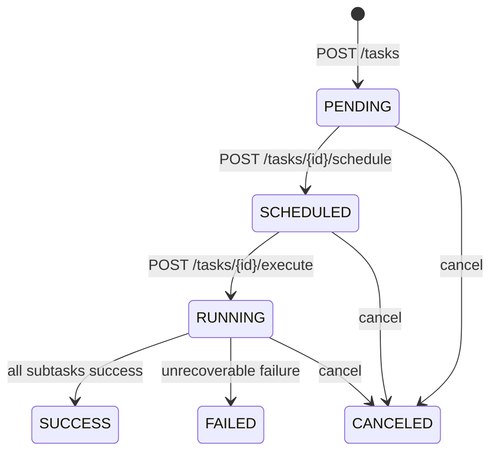
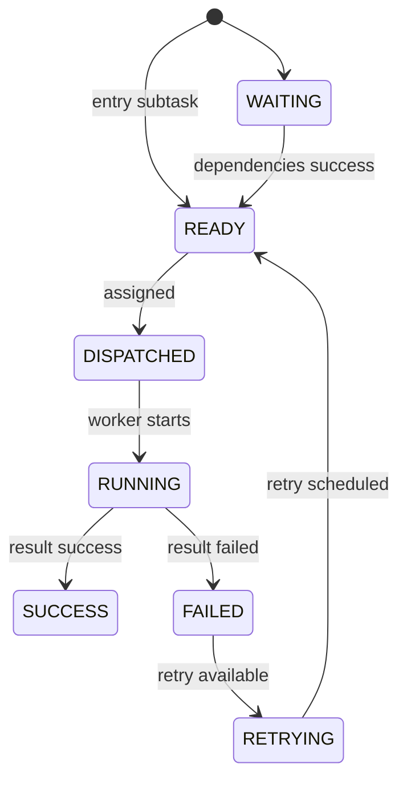

# API 设计文档

## 1. 文档目的

本文档用于定义“面向无人机边缘计算的 DAG 任务卸载调度系统”第一阶段的 HTTP API 草案，包括接口分组、请求字段、响应字段、错误格式、状态码、幂等约束和典型调用流程。

本文档承接：

- `docs/03_requirements_analysis.md`
- `docs/04_system_design.md`
- `docs/05_database_design.md`

后续 FastAPI 路由、Pydantic Schema、接口测试和 OpenAPI 文档都应以本文档为基础。

## 2. API 设计原则

### 2.1 使用 REST 风格

第一阶段优先使用 REST 风格接口，资源路径保持清晰、可读、易测试。

典型资源包括：

- `nodes`
- `tasks`
- `schedules`
- `executions`
- `metrics`

### 2.2 使用 JSON 作为请求和响应格式

所有请求体和响应体统一使用 JSON。时间字段使用 ISO 8601 字符串，例如：

```json
"2026-05-20T16:30:00+08:00"
```

### 2.3 API 版本化

第一阶段统一使用 `/api/v1` 前缀：

```text
/api/v1/nodes
/api/v1/tasks
```

这样后续如果接口发生破坏性变化，可以新增 `/api/v2`。

### 2.4 服务端生成业务 ID

除用户提交 DAG 内部的 `external_id` 外，节点 ID、任务 ID、子任务 ID、调度计划 ID、执行记录 ID 均由服务端生成 UUID。

### 2.5 响应结构保持一致

成功响应直接返回资源对象或操作结果。错误响应统一使用标准错误结构，便于前端、测试和调用方处理。

## 3. 通用规范

### 3.1 通用请求头

第一阶段暂不做认证，但预留请求头：

| Header | 必填 | 说明 |
| --- | --- | --- |
| `Content-Type: application/json` | 是 | JSON 请求体 |
| `X-Request-Id` | 否 | 请求追踪 ID，不传时服务端可生成 |
| `Idempotency-Key` | 否 | 幂等请求键，用于后续防止重复提交 |

### 3.2 通用错误响应

```json
{
  "error": {
    "code": "DAG_VALIDATION_FAILED",
    "message": "DAG contains a cycle",
    "details": {
      "cycle": ["detect_target", "analyze_result", "detect_target"]
    },
    "request_id": "req_123456"
  }
}
```

字段说明：

| 字段 | 类型 | 说明 |
| --- | --- | --- |
| `error.code` | string | 机器可读错误码 |
| `error.message` | string | 人类可读错误描述 |
| `error.details` | object | 可选，错误细节 |
| `error.request_id` | string | 请求追踪 ID |

### 3.3 常用 HTTP 状态码

| 状态码 | 使用场景 |
| --- | --- |
| `200 OK` | 查询成功、普通操作成功 |
| `201 Created` | 创建节点、创建任务成功 |
| `202 Accepted` | 接收执行请求，执行可能异步完成 |
| `400 Bad Request` | 请求字段错误或 DAG 不合法 |
| `404 Not Found` | 资源不存在 |
| `409 Conflict` | 状态冲突、重复操作、幂等冲突 |
| `422 Unprocessable Entity` | Pydantic 参数校验失败 |
| `500 Internal Server Error` | 未预期服务端错误 |

### 3.4 通用错误码

| 错误码 | 含义 |
| --- | --- |
| `VALIDATION_ERROR` | 请求参数校验失败 |
| `NODE_NOT_FOUND` | 节点不存在 |
| `TASK_NOT_FOUND` | 任务不存在 |
| `SUBTASK_NOT_FOUND` | 子任务不存在 |
| `DAG_VALIDATION_FAILED` | DAG 合法性校验失败 |
| `NO_AVAILABLE_NODE` | 没有可用执行节点 |
| `SCHEDULE_PLAN_NOT_FOUND` | 调度计划不存在 |
| `SCHEDULER_STRATEGY_NOT_FOUND` | 调度策略不存在 |
| `TASK_STATE_CONFLICT` | 任务状态不允许当前操作 |
| `EXECUTION_DUPLICATED` | 重复执行结果回传 |
| `INTERNAL_ERROR` | 服务端内部错误 |

### 3.5 分页格式

列表接口使用 `page` 和 `page_size`：

```text
GET /api/v1/tasks?page=1&page_size=20
```

分页响应格式：

```json
{
  "items": [],
  "page": 1,
  "page_size": 20,
  "total": 0
}
```

## 4. 数据模型摘要

### 4.1 Node

```json
{
  "id": "b5b18f2e-6b1f-4f30-9e4d-111111111111",
  "name": "UAV-001",
  "node_type": "UAV",
  "status": "ONLINE",
  "cpu_capacity": 100.0,
  "memory_capacity_mb": 2048,
  "network_address": "uav-001.local",
  "last_heartbeat_at": "2026-05-20T16:30:00+08:00",
  "created_at": "2026-05-20T16:00:00+08:00",
  "updated_at": "2026-05-20T16:30:00+08:00"
}
```

### 4.2 DAG Task

```json
{
  "id": "a44a6c04-7000-4b1f-9a1c-222222222222",
  "name": "inspection-task-001",
  "status": "PENDING",
  "priority": 1,
  "deadline_at": "2026-05-20T18:00:00+08:00",
  "created_at": "2026-05-20T16:35:00+08:00",
  "updated_at": "2026-05-20T16:35:00+08:00"
}
```

### 4.3 Subtask

```json
{
  "id": "9473735a-8ac0-40f8-b86b-333333333333",
  "task_id": "a44a6c04-7000-4b1f-9a1c-222222222222",
  "external_id": "detect_target",
  "name": "Detect target",
  "status": "WAITING",
  "compute_load": 300.0,
  "input_data_size_mb": 120.0,
  "output_data_size_mb": 10.0,
  "max_retries": 1,
  "retry_count": 0
}
```

### 4.4 Schedule Plan

```json
{
  "id": "f1d73c7b-6e2e-47ad-a4db-444444444444",
  "task_id": "a44a6c04-7000-4b1f-9a1c-222222222222",
  "strategy_name": "greedy",
  "status": "GENERATED",
  "estimated_total_duration_ms": 8500,
  "estimated_total_energy": 42.5,
  "created_at": "2026-05-20T16:36:00+08:00"
}
```

### 4.5 Execution Record

```json
{
  "id": "0d90e37d-9a9b-4207-9e38-555555555555",
  "task_id": "a44a6c04-7000-4b1f-9a1c-222222222222",
  "subtask_id": "9473735a-8ac0-40f8-b86b-333333333333",
  "node_id": "b5b18f2e-6b1f-4f30-9e4d-111111111111",
  "attempt": 1,
  "status": "SUCCESS",
  "started_at": "2026-05-20T16:37:00+08:00",
  "finished_at": "2026-05-20T16:37:03+08:00",
  "duration_ms": 3000,
  "output_summary": "target detected"
}
```

## 5. 健康检查 API

### 5.1 查询服务健康状态

```text
GET /api/v1/health
```

响应：

```json
{
  "status": "ok",
  "service": "uav-dag-offload-platform",
  "version": "0.1.0"
}
```

说明：

- 第一阶段只检查 API 服务是否可响应。
- 后续可扩展数据库、Redis、消息队列连接状态。

## 6. 节点管理 API

### 6.1 注册节点

```text
POST /api/v1/nodes
```

请求：

```json
{
  "name": "UAV-001",
  "node_type": "UAV",
  "cpu_capacity": 100.0,
  "memory_capacity_mb": 2048,
  "network_address": "uav-001.local",
  "description": "inspection uav"
}
```

响应：`201 Created`

```json
{
  "id": "b5b18f2e-6b1f-4f30-9e4d-111111111111",
  "name": "UAV-001",
  "node_type": "UAV",
  "status": "ONLINE",
  "cpu_capacity": 100.0,
  "memory_capacity_mb": 2048,
  "network_address": "uav-001.local",
  "description": "inspection uav",
  "created_at": "2026-05-20T16:00:00+08:00",
  "updated_at": "2026-05-20T16:00:00+08:00"
}
```

校验规则：

- `name` 必须唯一。
- `node_type` 只能是 `UAV` 或 `EDGE`。
- `cpu_capacity > 0`。
- `memory_capacity_mb > 0`。

### 6.2 查询节点列表

```text
GET /api/v1/nodes?node_type=UAV&status=ONLINE&page=1&page_size=20
```

查询参数：

| 参数 | 必填 | 说明 |
| --- | --- | --- |
| `node_type` | 否 | `UAV` 或 `EDGE` |
| `status` | 否 | `ONLINE`、`BUSY`、`OFFLINE` |
| `page` | 否 | 默认 `1` |
| `page_size` | 否 | 默认 `20` |

响应：

```json
{
  "items": [
    {
      "id": "b5b18f2e-6b1f-4f30-9e4d-111111111111",
      "name": "UAV-001",
      "node_type": "UAV",
      "status": "ONLINE",
      "cpu_capacity": 100.0,
      "memory_capacity_mb": 2048,
      "last_heartbeat_at": "2026-05-20T16:30:00+08:00"
    }
  ],
  "page": 1,
  "page_size": 20,
  "total": 1
}
```

### 6.3 查询节点详情

```text
GET /api/v1/nodes/{node_id}
```

响应：

```json
{
  "id": "b5b18f2e-6b1f-4f30-9e4d-111111111111",
  "name": "UAV-001",
  "node_type": "UAV",
  "status": "ONLINE",
  "cpu_capacity": 100.0,
  "memory_capacity_mb": 2048,
  "network_address": "uav-001.local",
  "last_heartbeat_at": "2026-05-20T16:30:00+08:00",
  "created_at": "2026-05-20T16:00:00+08:00",
  "updated_at": "2026-05-20T16:30:00+08:00"
}
```

### 6.4 上报节点状态

```text
POST /api/v1/nodes/{node_id}/status
```

请求：

```json
{
  "battery_level": 82.5,
  "cpu_usage": 35.0,
  "memory_usage": 40.0,
  "network_quality": 85.0,
  "bandwidth_mbps": 12.5,
  "latitude": 31.230416,
  "longitude": 121.473701,
  "current_load": 1,
  "queue_length": 2,
  "reported_at": "2026-05-20T16:30:00+08:00"
}
```

响应：

```json
{
  "id": "8b01c2d6-9ef5-49b6-af3f-666666666666",
  "node_id": "b5b18f2e-6b1f-4f30-9e4d-111111111111",
  "status": "ONLINE",
  "reported_at": "2026-05-20T16:30:00+08:00",
  "created_at": "2026-05-20T16:30:01+08:00"
}
```

说明：

- 上报成功后更新 `nodes.last_heartbeat_at`。
- 如果节点原本为 `OFFLINE`，收到状态上报后可恢复为 `ONLINE`。
- 第一阶段暂不要求真实设备签名认证。

### 6.5 查询节点状态历史

```text
GET /api/v1/nodes/{node_id}/status-records?page=1&page_size=20
```

响应：

```json
{
  "items": [
    {
      "id": "8b01c2d6-9ef5-49b6-af3f-666666666666",
      "battery_level": 82.5,
      "cpu_usage": 35.0,
      "memory_usage": 40.0,
      "network_quality": 85.0,
      "bandwidth_mbps": 12.5,
      "reported_at": "2026-05-20T16:30:00+08:00"
    }
  ],
  "page": 1,
  "page_size": 20,
  "total": 1
}
```

## 7. DAG 任务 API

### 7.1 创建 DAG 任务

```text
POST /api/v1/tasks
```

请求：

```json
{
  "name": "inspection-task-001",
  "priority": 1,
  "deadline_at": "2026-05-20T18:00:00+08:00",
  "subtasks": [
    {
      "external_id": "capture_image",
      "name": "Capture image",
      "compute_load": 80.0,
      "input_data_size_mb": 0.0,
      "output_data_size_mb": 120.0,
      "max_retries": 1
    },
    {
      "external_id": "detect_target",
      "name": "Detect target",
      "compute_load": 300.0,
      "input_data_size_mb": 120.0,
      "output_data_size_mb": 10.0,
      "max_retries": 1
    },
    {
      "external_id": "compress_image",
      "name": "Compress image",
      "compute_load": 120.0,
      "input_data_size_mb": 120.0,
      "output_data_size_mb": 30.0,
      "max_retries": 1
    },
    {
      "external_id": "analyze_result",
      "name": "Analyze result",
      "compute_load": 160.0,
      "input_data_size_mb": 10.0,
      "output_data_size_mb": 5.0,
      "max_retries": 1
    },
    {
      "external_id": "upload_report",
      "name": "Upload report",
      "compute_load": 40.0,
      "input_data_size_mb": 35.0,
      "output_data_size_mb": 2.0,
      "max_retries": 1
    }
  ],
  "dependencies": [
    {
      "from": "capture_image",
      "to": "detect_target"
    },
    {
      "from": "capture_image",
      "to": "compress_image"
    },
    {
      "from": "detect_target",
      "to": "analyze_result"
    },
    {
      "from": "analyze_result",
      "to": "upload_report"
    },
    {
      "from": "compress_image",
      "to": "upload_report"
    }
  ],
  "metadata": {
    "mission": "road-inspection"
  }
}
```

响应：`201 Created`

```json
{
  "id": "a44a6c04-7000-4b1f-9a1c-222222222222",
  "name": "inspection-task-001",
  "status": "PENDING",
  "priority": 1,
  "deadline_at": "2026-05-20T18:00:00+08:00",
  "subtask_count": 5,
  "dependency_count": 5,
  "created_at": "2026-05-20T16:35:00+08:00"
}
```

DAG 校验规则：

- `subtasks` 不能为空。
- `external_id` 在同一个任务内不能重复。
- `dependencies.from` 和 `dependencies.to` 必须引用已存在的 `external_id`。
- 不允许出现环。
- 至少存在一个入口子任务。
- 至少存在一个出口子任务。

### 7.2 查询任务列表

```text
GET /api/v1/tasks?status=PENDING&page=1&page_size=20
```

查询参数：

| 参数 | 必填 | 说明 |
| --- | --- | --- |
| `status` | 否 | 任务状态 |
| `page` | 否 | 默认 `1` |
| `page_size` | 否 | 默认 `20` |

响应：

```json
{
  "items": [
    {
      "id": "a44a6c04-7000-4b1f-9a1c-222222222222",
      "name": "inspection-task-001",
      "status": "PENDING",
      "priority": 1,
      "subtask_count": 5,
      "created_at": "2026-05-20T16:35:00+08:00"
    }
  ],
  "page": 1,
  "page_size": 20,
  "total": 1
}
```

### 7.3 查询任务详情

```text
GET /api/v1/tasks/{task_id}
```

响应：

```json
{
  "id": "a44a6c04-7000-4b1f-9a1c-222222222222",
  "name": "inspection-task-001",
  "status": "PENDING",
  "priority": 1,
  "deadline_at": "2026-05-20T18:00:00+08:00",
  "subtasks": [
    {
      "id": "9473735a-8ac0-40f8-b86b-333333333333",
      "external_id": "capture_image",
      "name": "Capture image",
      "status": "READY",
      "compute_load": 80.0,
      "input_data_size_mb": 0.0,
      "output_data_size_mb": 120.0
    }
  ],
  "dependencies": [
    {
      "from": "capture_image",
      "to": "detect_target"
    }
  ],
  "created_at": "2026-05-20T16:35:00+08:00",
  "updated_at": "2026-05-20T16:35:00+08:00"
}
```

### 7.4 查询子任务列表

```text
GET /api/v1/tasks/{task_id}/subtasks?status=READY
```

响应：

```json
{
  "items": [
    {
      "id": "9473735a-8ac0-40f8-b86b-333333333333",
      "external_id": "capture_image",
      "name": "Capture image",
      "status": "READY",
      "retry_count": 0,
      "max_retries": 1
    }
  ]
}
```

### 7.5 取消任务

```text
POST /api/v1/tasks/{task_id}/cancel
```

请求：

```json
{
  "reason": "user canceled the mission"
}
```

响应：

```json
{
  "task_id": "a44a6c04-7000-4b1f-9a1c-222222222222",
  "status": "CANCELED",
  "reason": "user canceled the mission",
  "updated_at": "2026-05-20T16:40:00+08:00"
}
```

规则：

- `PENDING`、`SCHEDULED`、`RUNNING` 状态可以取消。
- `SUCCESS`、`FAILED`、`CANCELED` 状态不应重复取消。
- 第一阶段如果任务已经开始模拟执行，可以只标记任务取消，不强制中断正在运行的本地模拟函数。

## 8. 调度 API

### 8.1 触发调度

```text
POST /api/v1/tasks/{task_id}/schedule
```

请求：

```json
{
  "strategy_name": "greedy",
  "options": {
    "energy_cost_weight": 0.2,
    "random_seed": 42
  }
}
```

响应：

```json
{
  "id": "f1d73c7b-6e2e-47ad-a4db-444444444444",
  "task_id": "a44a6c04-7000-4b1f-9a1c-222222222222",
  "strategy_name": "greedy",
  "status": "GENERATED",
  "estimated_total_duration_ms": 8500,
  "estimated_total_energy": 42.5,
  "items": [
    {
      "subtask_external_id": "capture_image",
      "assigned_node_id": "b5b18f2e-6b1f-4f30-9e4d-111111111111",
      "assigned_node_name": "UAV-001",
      "estimated_compute_duration_ms": 800,
      "estimated_transfer_duration_ms": 0,
      "estimated_energy": 3.2,
      "decision_reason": "input data is local to UAV"
    }
  ],
  "created_at": "2026-05-20T16:36:00+08:00"
}
```

规则：

- 只有 `PENDING` 或允许重新调度的任务可以触发调度。
- 第一阶段支持 `local_only`、`random_offload`、`greedy`。
- 没有可用节点时返回 `NO_AVAILABLE_NODE`。
- 调度成功后任务状态更新为 `SCHEDULED`。

### 8.2 查询任务调度计划列表

```text
GET /api/v1/tasks/{task_id}/schedules
```

响应：

```json
{
  "items": [
    {
      "id": "f1d73c7b-6e2e-47ad-a4db-444444444444",
      "strategy_name": "greedy",
      "status": "GENERATED",
      "estimated_total_duration_ms": 8500,
      "estimated_total_energy": 42.5,
      "created_at": "2026-05-20T16:36:00+08:00"
    }
  ]
}
```

### 8.3 查询调度计划详情

```text
GET /api/v1/schedules/{schedule_plan_id}
```

响应：

```json
{
  "id": "f1d73c7b-6e2e-47ad-a4db-444444444444",
  "task_id": "a44a6c04-7000-4b1f-9a1c-222222222222",
  "strategy_name": "greedy",
  "status": "GENERATED",
  "items": [
    {
      "subtask_id": "9473735a-8ac0-40f8-b86b-333333333333",
      "subtask_external_id": "capture_image",
      "assigned_node_id": "b5b18f2e-6b1f-4f30-9e4d-111111111111",
      "assigned_node_name": "UAV-001",
      "estimated_start_at": "2026-05-20T16:37:00+08:00",
      "estimated_finish_at": "2026-05-20T16:37:01+08:00",
      "estimated_compute_duration_ms": 800,
      "estimated_transfer_duration_ms": 0,
      "estimated_energy": 3.2
    }
  ]
}
```

## 9. 执行 API

### 9.1 触发模拟执行

```text
POST /api/v1/tasks/{task_id}/execute
```

请求：

```json
{
  "schedule_plan_id": "f1d73c7b-6e2e-47ad-a4db-444444444444",
  "mode": "simulate",
  "failure_rate": 0.0
}
```

响应：`202 Accepted`

```json
{
  "task_id": "a44a6c04-7000-4b1f-9a1c-222222222222",
  "schedule_plan_id": "f1d73c7b-6e2e-47ad-a4db-444444444444",
  "status": "RUNNING",
  "message": "execution started"
}
```

规则：

- 任务必须已经 `SCHEDULED`。
- 调度计划必须属于该任务。
- 第一阶段可以同步模拟执行，也可以用后台任务模拟。
- 执行开始后任务状态更新为 `RUNNING`。

### 9.2 查询任务执行记录

```text
GET /api/v1/tasks/{task_id}/executions
```

响应：

```json
{
  "items": [
    {
      "id": "0d90e37d-9a9b-4207-9e38-555555555555",
      "subtask_external_id": "capture_image",
      "node_name": "UAV-001",
      "attempt": 1,
      "status": "SUCCESS",
      "started_at": "2026-05-20T16:37:00+08:00",
      "finished_at": "2026-05-20T16:37:03+08:00",
      "duration_ms": 3000,
      "output_summary": "image captured"
    }
  ]
}
```

### 9.3 回传子任务执行结果

```text
POST /api/v1/executions/{execution_id}/result
```

请求：

```json
{
  "status": "SUCCESS",
  "finished_at": "2026-05-20T16:37:03+08:00",
  "duration_ms": 3000,
  "output_summary": "image captured",
  "failure_reason": null
}
```

响应：

```json
{
  "execution_id": "0d90e37d-9a9b-4207-9e38-555555555555",
  "subtask_status": "SUCCESS",
  "task_status": "RUNNING",
  "accepted": true
}
```

幂等规则：

- 同一个 `execution_id` 的重复成功回传返回当前结果，不重复推进状态。
- 已经 `SUCCESS` 的子任务不被后到达的失败结果覆盖。
- 如果回传状态与当前执行记录冲突，返回 `409 Conflict`。

说明：

- 第一阶段模拟 Worker 可以直接调用服务层，不一定真的走 HTTP。
- 仍然保留该接口设计，方便第二阶段拆分真实 Worker。

## 10. 结果和指标 API

### 10.1 查询任务结果

```text
GET /api/v1/tasks/{task_id}/results
```

响应：

```json
{
  "task_id": "a44a6c04-7000-4b1f-9a1c-222222222222",
  "task_status": "SUCCESS",
  "subtasks": [
    {
      "external_id": "capture_image",
      "status": "SUCCESS",
      "executed_node_name": "UAV-001",
      "duration_ms": 3000,
      "output_summary": "image captured"
    }
  ],
  "started_at": "2026-05-20T16:37:00+08:00",
  "finished_at": "2026-05-20T16:37:20+08:00"
}
```

### 10.2 查询任务指标

```text
GET /api/v1/tasks/{task_id}/metrics
```

响应：

```json
{
  "task_id": "a44a6c04-7000-4b1f-9a1c-222222222222",
  "plan_id": "f1d73c7b-6e2e-47ad-a4db-444444444444",
  "total_duration_ms": 20000,
  "success_subtask_count": 5,
  "failed_subtask_count": 0,
  "retry_count": 0,
  "local_execution_count": 2,
  "offload_execution_count": 3,
  "average_subtask_duration_ms": 3200.0,
  "estimated_energy": 42.5,
  "actual_energy": 40.8,
  "created_at": "2026-05-20T16:38:00+08:00"
}
```

### 10.3 对比调度策略指标

```text
GET /api/v1/tasks/{task_id}/schedule-comparison
```

响应：

```json
{
  "task_id": "a44a6c04-7000-4b1f-9a1c-222222222222",
  "items": [
    {
      "strategy_name": "local_only",
      "estimated_total_duration_ms": 18000,
      "estimated_total_energy": 60.0
    },
    {
      "strategy_name": "random_offload",
      "estimated_total_duration_ms": 12000,
      "estimated_total_energy": 50.0
    },
    {
      "strategy_name": "greedy",
      "estimated_total_duration_ms": 8500,
      "estimated_total_energy": 42.5
    }
  ]
}
```

说明：

- 第一阶段可以只比较已生成过的调度计划。
- 后续可支持一次性对同一个 DAG 运行多种策略并生成对比结果。

## 11. 第一阶段完整调用流程

### 11.1 注册节点

```text
POST /api/v1/nodes
POST /api/v1/nodes
```

注册：

- `UAV-001`
- `EDGE-001`

### 11.2 上报节点状态

```text
POST /api/v1/nodes/{uav_id}/status
POST /api/v1/nodes/{edge_id}/status
```

### 11.3 创建 DAG 任务

```text
POST /api/v1/tasks
```

提交包含 5 个子任务的 DAG。

### 11.4 触发调度

```text
POST /api/v1/tasks/{task_id}/schedule
```

请求策略：

```json
{
  "strategy_name": "greedy"
}
```

### 11.5 触发模拟执行

```text
POST /api/v1/tasks/{task_id}/execute
```

### 11.6 查询结果和指标

```text
GET /api/v1/tasks/{task_id}
GET /api/v1/tasks/{task_id}/results
GET /api/v1/tasks/{task_id}/metrics
```

验收标准：

- 总任务最终状态为 `SUCCESS`。
- 5 个子任务均为 `SUCCESS`。
- 每个子任务能查询到执行节点、执行耗时和输出摘要。

## 12. 状态流转与接口关系

### 12.1 任务状态流转



### 12.2 子任务状态流转



## 13. Pydantic Schema 建议

第一阶段建议按接口分组创建 Schema：

```text
app/schemas/
  node.py
  task.py
  schedule.py
  execution.py
  metrics.py
  common.py
```

建议命名：

```text
NodeCreate
NodeRead
NodeStatusCreate
DagTaskCreate
DagTaskRead
SubtaskCreate
DependencyCreate
ScheduleRequest
SchedulePlanRead
ExecutionStartRequest
ExecutionRecordRead
TaskMetricsRead
ErrorResponse
PaginatedResponse
```

注意事项：

- Pydantic Schema 可以使用 `metadata` 字段。
- SQLAlchemy ORM 模型中不要直接用 `metadata` 作为属性名。
- 金额类字段本项目暂不涉及。
- `numeric` 类型在 API 中可以先序列化为 number，后续如需高精度再改为 string。

## 14. 测试用例建议

API 层测试建议覆盖：

1. 注册 UAV 节点成功。
2. 注册 EDGE 节点成功。
3. 重复节点名称返回错误。
4. 节点状态上报成功。
5. 创建合法 DAG 成功。
6. 创建包含环的 DAG 失败。
7. 创建依赖不存在的 DAG 失败。
8. 贪心策略调度成功。
9. 不存在的调度策略返回错误。
10. 模拟执行后任务最终成功。
11. 重复执行结果回传保持幂等。
12. 查询结果和指标成功。

## 15. 当前结论

第一阶段 API 应服务于“节点注册、状态上报、DAG 创建、调度、执行、查询”这一条主闭环。接口设计保持简单，但要提前保留幂等、分页、错误码、状态约束和策略扩展点。

完成本文档后，下一步可以继续编写 `docs/07_state_machine_design.md`，把任务、子任务和节点的状态迁移规则进一步细化；也可以开始 `docs/08_backend_scaffold_plan.md`，准备进入 FastAPI 项目骨架实现。
