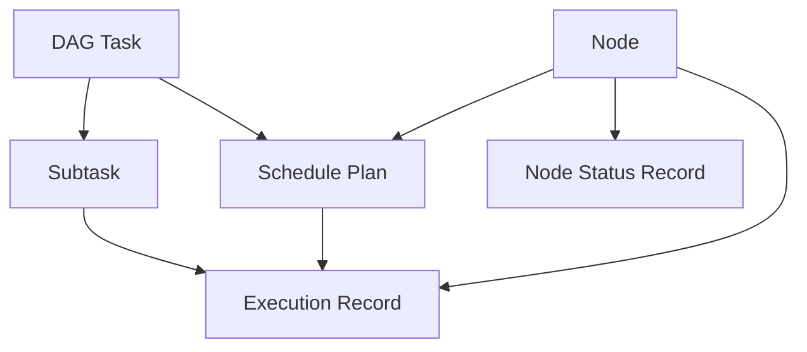
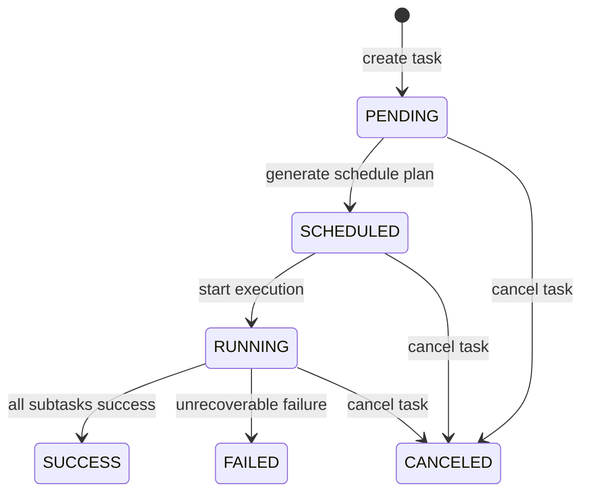
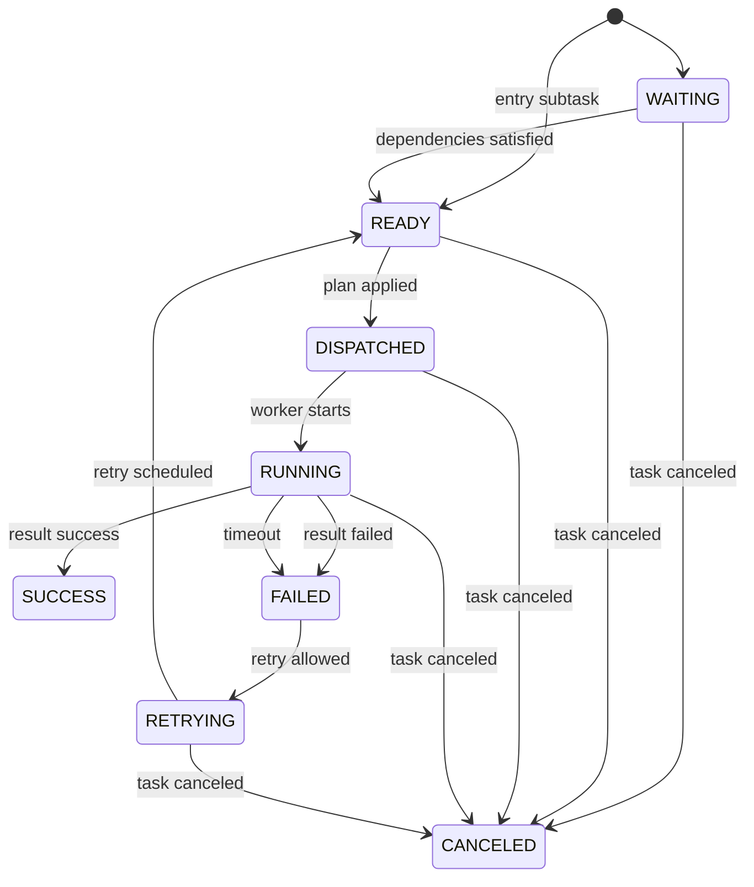
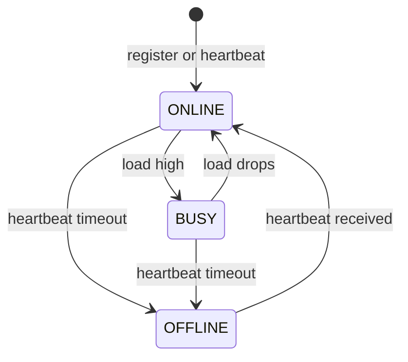
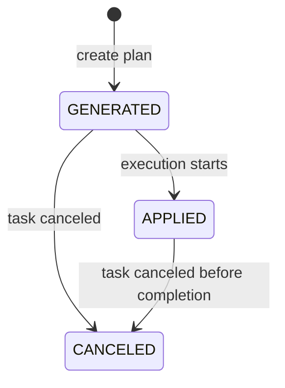
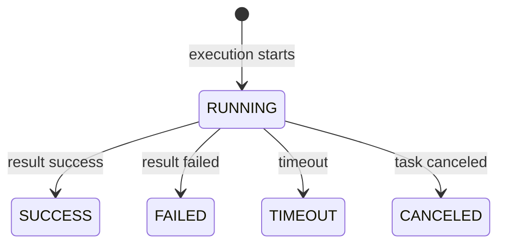

# 状态机设计文档

## 1. 文档目的

本文档用于定义“面向无人机边缘计算的 DAG 任务卸载调度系统”第一阶段的状态迁移规则，包括任务状态、子任务状态、节点状态、调度计划状态和执行记录状态。

本文档承接：

- `docs/03_requirements_analysis.md`
- `docs/04_system_design.md`
- `docs/05_database_design.md`
- `docs/06_api_design.md`

后续服务层实现、状态校验、幂等处理、异常回滚和测试用例都应以本文档为依据。

## 2. 设计目标

状态机设计的核心目标不是“状态多”，而是“状态清楚”：

1. 每个状态的含义明确。
2. 每条迁移路径都可解释。
3. 非法状态迁移必须被拒绝。
4. 重复回调和重复提交必须幂等。
5. 任务、子任务、节点、调度计划之间的状态协作要可追踪。

第一阶段采用“显式状态机 + 服务层统一更新”的方式，不让接口层、Worker 或调度策略直接随意改状态。

## 3. 状态机设计原则

### 3.1 单一写入口

状态只能由服务层更新，例如：

- `DagTaskService`
- `SchedulingService`
- `ExecutionService`
- `NodeService`

接口层只接收请求，不直接改数据库状态。

### 3.2 状态迁移必须合法

每次状态变化都要检查：

- 当前状态是否允许迁移到目标状态。
- 当前操作是否属于当前任务生命周期阶段。
- 是否已经处理过同一个执行结果。
- 是否存在并发更新冲突。

### 3.3 状态变化要有事件含义

状态不会凭空变化，而是由明确事件触发：

- 创建任务
- 调度完成
- 子任务下发
- Worker 开始执行
- Worker 回传成功或失败
- 任务取消
- 节点心跳超时
- 节点恢复上报

### 3.4 终态尽量稳定

终态状态一旦进入，原则上不应再被普通流程覆盖。

终态包括：

- `SUCCESS`
- `FAILED`
- `CANCELED`
- `OFFLINE`（节点）
- `CANCELED`（调度计划）

## 4. 总体状态关系



任务状态由子任务状态聚合而来，调度计划状态由执行状态驱动，节点状态由心跳和状态上报驱动。

## 5. DAG 总任务状态机

### 5.1 状态定义

| 状态 | 含义 |
| --- | --- |
| `PENDING` | 任务已创建，等待调度 |
| `SCHEDULED` | 调度计划已生成 |
| `RUNNING` | 任务正在执行中 |
| `SUCCESS` | 所有子任务成功完成 |
| `FAILED` | 任务失败且无法继续 |
| `CANCELED` | 任务已取消 |

### 5.2 状态图



### 5.3 状态迁移表

| 当前状态 | 目标状态 | 触发事件 | 是否允许 |
| --- | --- | --- | --- |
| 无 | `PENDING` | 创建任务 | 是 |
| `PENDING` | `SCHEDULED` | 调度成功 | 是 |
| `PENDING` | `CANCELED` | 取消任务 | 是 |
| `SCHEDULED` | `RUNNING` | 开始执行 | 是 |
| `SCHEDULED` | `CANCELED` | 取消任务 | 是 |
| `RUNNING` | `SUCCESS` | 全部子任务成功 | 是 |
| `RUNNING` | `FAILED` | 不可恢复失败 | 是 |
| `RUNNING` | `CANCELED` | 取消任务 | 是 |
| `SUCCESS` | 其他 | 普通流程 | 否 |
| `FAILED` | 其他 | 普通流程 | 否 |
| `CANCELED` | 其他 | 普通流程 | 否 |

### 5.4 聚合规则

任务状态不是独立随便写的，而是由子任务状态聚合判断：

1. 任务创建后默认 `PENDING`。
2. 调度计划生成后，任务变为 `SCHEDULED`。
3. 有任意子任务进入 `RUNNING` 后，任务变为 `RUNNING`。
4. 所有子任务最终成功后，任务变为 `SUCCESS`。
5. 存在子任务终态失败且无可继续重试时，任务变为 `FAILED`。
6. 用户取消后，任务变为 `CANCELED`。

### 5.5 任务失败判定

任务是否失败，建议遵循以下规则：

- 子任务失败但仍可重试时，任务保持 `RUNNING`。
- 所有入口或关键链路子任务都无法继续时，任务标记为 `FAILED`。
- 如果是测试阶段的简化实现，也可以在任意关键子任务最终失败时直接将任务标记为 `FAILED`。

第一阶段建议采用“保守失败”策略，即只要某个不可恢复子任务失败，就认为总任务失败。

## 6. 子任务状态机

### 6.1 状态定义

| 状态 | 含义 |
| --- | --- |
| `WAITING` | 前置依赖未完成 |
| `READY` | 依赖完成，可被调度或执行 |
| `DISPATCHED` | 已分配执行节点 |
| `RUNNING` | 正在执行 |
| `SUCCESS` | 执行成功 |
| `FAILED` | 执行失败 |
| `RETRYING` | 失败后等待重试 |
| `CANCELED` | 子任务被取消 |

### 6.2 状态图



### 6.3 状态迁移表

| 当前状态 | 目标状态 | 触发事件 | 是否允许 |
| --- | --- | --- | --- |
| 无 | `WAITING` | 子任务创建且有前置依赖 | 是 |
| 无 | `READY` | 子任务创建且无前置依赖 | 是 |
| `WAITING` | `READY` | 前置依赖全部成功 | 是 |
| `READY` | `DISPATCHED` | 调度计划应用 | 是 |
| `DISPATCHED` | `RUNNING` | Worker 开始执行 | 是 |
| `RUNNING` | `SUCCESS` | 回传成功 | 是 |
| `RUNNING` | `FAILED` | 回传失败 | 是 |
| `RUNNING` | `FAILED` | 超时 | 是 |
| `FAILED` | `RETRYING` | 可重试 | 是 |
| `RETRYING` | `READY` | 重试计划生效 | 是 |
| `WAITING` | `CANCELED` | 任务取消 | 是 |
| `READY` | `CANCELED` | 任务取消 | 是 |
| `DISPATCHED` | `CANCELED` | 任务取消 | 是 |
| `RUNNING` | `CANCELED` | 任务取消 | 是 |
| `RETRYING` | `CANCELED` | 任务取消 | 是 |
| `SUCCESS` | 其他 | 普通流程 | 否 |
| `FAILED` | 其他 | 普通流程 | 否 |
| `CANCELED` | 其他 | 普通流程 | 否 |

### 6.4 子任务状态说明

#### `WAITING`

表示子任务已经存在，但前置依赖还没全部完成。

#### `READY`

表示子任务可以进入执行队列，等待调度器或执行器分配节点。

#### `DISPATCHED`

表示子任务已经被分配给某个执行节点，尚未真正开始跑。

#### `RUNNING`

表示执行节点已经接手子任务并开始处理。

#### `SUCCESS`

表示子任务执行成功并已经回传结果。

#### `FAILED`

表示子任务执行失败，或者已经超时且无法继续当前尝试。

#### `RETRYING`

表示子任务进入重试等待阶段，尚未重新回到 `READY`。

#### `CANCELED`

表示总任务已经被用户或系统取消，这个子任务不应再被调度、执行或由迟到结果覆盖。

### 6.5 子任务取消问题

当前版本已经为子任务增加 `CANCELED`，所以取消任务时的处理方式是：

- 任务整体进入 `CANCELED`。
- 非终态子任务进入 `CANCELED`。
- 正在运行的执行记录进入 `CANCELED`。
- 后续不再调度新的子任务。
- Worker 或节点迟到回传时，如果执行记录已经不是 `RUNNING`，结果不再被接受。

这样做的原因是：取消任务不是只改总任务字段，还要阻止子任务和执行记录继续被异步回调推进。

已经进入 `SUCCESS` 或 `FAILED` 的子任务保留原事实，不再强行覆盖为取消。

## 7. 节点状态机

### 7.1 状态定义

| 状态 | 含义 |
| --- | --- |
| `ONLINE` | 节点在线且可用 |
| `BUSY` | 节点在线但负载较高 |
| `OFFLINE` | 节点离线或心跳超时 |

### 7.2 状态图



### 7.3 状态迁移表

| 当前状态 | 目标状态 | 触发事件 | 是否允许 |
| --- | --- | --- | --- |
| 无 | `ONLINE` | 节点注册 | 是 |
| `ONLINE` | `BUSY` | 负载过高 | 是 |
| `BUSY` | `ONLINE` | 负载恢复 | 是 |
| `ONLINE` | `OFFLINE` | 心跳超时 | 是 |
| `BUSY` | `OFFLINE` | 心跳超时 | 是 |
| `OFFLINE` | `ONLINE` | 收到心跳或状态上报 | 是 |

### 7.4 节点状态判定规则

节点状态由以下信息综合判断：

- 心跳时间是否超时。
- CPU / 内存 / 队列负载是否超过阈值。
- 是否收到最新状态上报。

第一阶段可以先用简单规则：

- 最近心跳超时则 `OFFLINE`。
- 未超时但 CPU 或队列过高则 `BUSY`。
- 其余情况为 `ONLINE`。

## 8. 调度计划状态机

### 8.1 状态定义

| 状态 | 含义 |
| --- | --- |
| `GENERATED` | 已生成调度计划 |
| `APPLIED` | 调度计划已被执行模块采用 |
| `CANCELED` | 调度计划已取消 |

### 8.2 状态图



### 8.3 状态迁移表

| 当前状态 | 目标状态 | 触发事件 | 是否允许 |
| --- | --- | --- | --- |
| 无 | `GENERATED` | 调度生成 | 是 |
| `GENERATED` | `APPLIED` | 开始执行 | 是 |
| `GENERATED` | `CANCELED` | 任务取消 | 是 |
| `APPLIED` | `CANCELED` | 任务取消 | 是 |

### 8.4 计划应用规则

调度计划一旦进入 `APPLIED`，表示执行模块已经开始采用这份计划。

第一阶段建议：

- 一个任务在同一时间只允许一个 `APPLIED` 计划。
- 新计划若要替换旧计划，需要先取消旧计划或把任务重新回到可调度状态。

## 9. 执行记录状态机

### 9.1 状态定义

| 状态 | 含义 |
| --- | --- |
| `RUNNING` | 正在执行 |
| `SUCCESS` | 执行成功 |
| `FAILED` | 执行失败 |
| `TIMEOUT` | 执行超时 |
| `CANCELED` | 执行被取消 |

### 9.2 状态图



### 9.3 状态迁移表

| 当前状态 | 目标状态 | 触发事件 | 是否允许 |
| --- | --- | --- | --- |
| 无 | `RUNNING` | 创建执行记录 | 是 |
| `RUNNING` | `SUCCESS` | 回传成功 | 是 |
| `RUNNING` | `FAILED` | 回传失败 | 是 |
| `RUNNING` | `TIMEOUT` | 超时检测 | 是 |
| `RUNNING` | `CANCELED` | 任务取消 | 是 |

### 9.4 幂等处理

执行记录是幂等边界的关键对象：

- `execution_id` 必须唯一。
- 同一个 `execution_id` 的重复回传只能处理一次。
- 已经终止的执行记录不应再被普通回调覆盖。

## 10. 状态联动规则

### 10.1 子任务完成后推动后继子任务

当某个子任务进入 `SUCCESS` 后：

1. 检查其所有后继子任务的前置依赖是否都成功。
2. 若满足条件，则将后继子任务从 `WAITING` 更新为 `READY`。
3. 若后继子任务已经进入 `READY` 以外状态，不重复修改。

### 10.2 子任务失败后处理重试

当子任务进入 `FAILED` 后：

1. 检查 `retry_count < max_retries`。
2. 若可以重试，进入 `RETRYING`。
3. 重新排队后返回 `READY`。
4. 若不可重试，保持 `FAILED`。

### 10.3 任务终态判定

任务进入终态的规则：

- 所有子任务成功 -> `SUCCESS`
- 出现不可恢复失败 -> `FAILED`
- 用户或系统取消 -> `CANCELED`

### 10.4 节点离线后的联动

当节点从 `ONLINE/BUSY` 变为 `OFFLINE` 后：

1. 标记该节点为不可调度。
2. 检查正在该节点上执行的执行记录。
3. 根据执行记录状态决定是超时、失败还是重新调度。
4. 受影响子任务可重新进入 `READY` 或保持失败，由后续策略决定。

## 11. 状态迁移校验方法

建议在服务层实现统一校验函数：

```text
can_transition(current_state, target_state, event) -> bool
```

以及统一迁移函数：

```text
transition(entity, target_state, event, actor) -> entity
```

建议所有状态修改都经过：

1. 读取当前状态。
2. 校验目标状态是否合法。
3. 在事务中写入状态和关联记录。
4. 记录状态变化时间和原因。

## 12. 异常状态与错误码

### 12.1 常见错误

| 场景 | 错误码 |
| --- | --- |
| 非法状态迁移 | `TASK_STATE_CONFLICT` |
| 重复执行结果回传 | `EXECUTION_DUPLICATED` |
| 计划不存在 | `SCHEDULE_PLAN_NOT_FOUND` |
| 节点不存在 | `NODE_NOT_FOUND` |
| DAG 不合法 | `DAG_VALIDATION_FAILED` |

### 12.2 常见错误处理原则

- 返回清晰错误码，不只返回“失败”。
- 错误消息要能帮助定位到状态冲突发生在哪一步。
- 幂等冲突优先返回已有结果，而不是报一堆内部错误。

## 13. 测试用例建议

### 13.1 任务状态测试

1. 创建任务后状态为 `PENDING`。
2. 调度成功后状态为 `SCHEDULED`。
3. 开始执行后状态为 `RUNNING`。
4. 全部子任务成功后状态为 `SUCCESS`。
5. 不可恢复失败后状态为 `FAILED`。
6. 取消任务后状态为 `CANCELED`。

### 13.2 子任务状态测试

1. 无前置依赖子任务创建后直接 `READY`。
2. 有前置依赖子任务创建后为 `WAITING`。
3. 依赖满足后从 `WAITING` 到 `READY`。
4. 调度后进入 `DISPATCHED`。
5. Worker 开始执行后进入 `RUNNING`。
6. 成功回传后进入 `SUCCESS`。
7. 失败且可重试后进入 `RETRYING`。
8. 任务取消后，非终态子任务进入 `CANCELED`。

### 13.3 节点状态测试

1. 节点注册后进入 `ONLINE`。
2. 心跳超时后进入 `OFFLINE`。
3. 重新上报后回到 `ONLINE`。
4. 高负载时进入 `BUSY`。

### 13.4 幂等测试

1. 重复回传同一个 `execution_id` 不重复推进状态。
2. 已成功的执行不应被失败回调覆盖。
3. 重复触发调度应返回冲突或已有计划。

## 14. 实现建议

第一阶段实现状态机时建议：

1. 把状态常量集中放在 `app/domain/status.py` 或类似模块。
2. 把状态迁移表写成字典或枚举映射，便于测试。
3. 统一用服务层处理状态转移，不在路由函数中散写判断。
4. 所有状态变更都记录时间和原因。
5. 先实现最小状态集，不要急着加额外状态。

## 15. 当前结论

这个项目的状态机应该围绕“任务、子任务、节点、调度计划、执行记录”五类对象展开。第一阶段的重点不是状态数量，而是状态边界、迁移路径和联动规则要足够清楚。

只要状态机设计清楚，后续 FastAPI、SQLAlchemy、Celery、MQTT 和测试就会顺很多。
